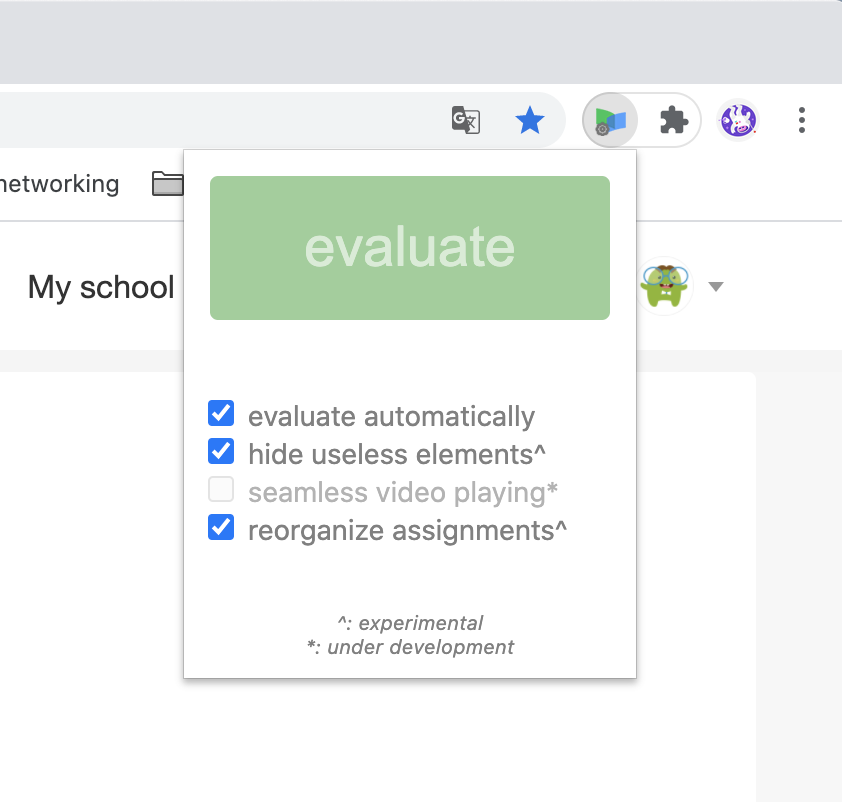

# MOOC-wizard
a small chrome extension for 163-mooc (icourse163.org) users  

**Not meant to finish exam or homework for anyone, but committed to optimize your studying experience on 163-mooc.**

## Features
_in the latest version: 1.0_  
 
It's not in the evaluation page, so the button is disabled. 
 

### Evaluate! _and_ evaluate automatically
MOOC-wizard can help you to evaluate others' homework to save your time.  
Click **evaluate!** button to evaluate for a single time.  
When **evaluate automatically** is on, once you enter the evaluation page, evaluation will be done automatically.  
 

### Hide useless elements _(experimental)_
Using this function, the 163-MOOC webpage will be nice and clean.  
 

### Seamless video playing _(under development)_
This function is under development, but you are encouraged to contribute to it.  
 

### Reorganize assignments _(experimental)_
Assignments on 163-MOOC are by default in chronological order.  
MOOC-wizard can pin the assignments that are about to expire on top, and list the passed ones below.  
 

## Download and Install
Since the extension has not been uploaded to Chrome Web Store or AMO, one can only install the extension using source code.  
### Chrome / Edge
Since the extension has not been uploaded to Chrome Web Store, one can only install the extension using source code.  
1. Download and unzip this repo  
2. Visit `chrome://extensions/` or `edge://extensions/`  
3. Enable “Developer mode”  
4. Click “Load unpacked”  
5. Select folder which includes `manifest.json`  
### Firefox
1. Download and unzip this repo  
2. Visit `about:debugging#/runtime/this-firefox`  
3. Click “Load Temporary Add-on”  
4. Select `manifest.json`  
 

## License
[The MIT License (MIT)](https://raw.githubusercontent.com/YS-Wong/MOOC-wizard/main/LICENSE)  
 
